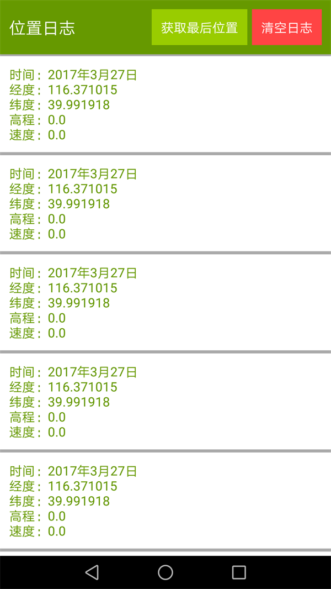

# GEO-LOCATION-LIB

<a href="https://scan.coverity.com/projects/dennisguo-geo-location-lib">
  
</a>


由GeoBeans开发的用于android定位相关的工具库.

## 使用方法

第一步：首先在`build.gradle`中加入依赖

```
compile "cn.geobeans:geo-location-lib:1.0.0"
```

第二步：在应用的`AndroidManifest.xml`文件中注册服务

```xml
<service android:name="cn.geobeans.app.lib.location.GeoLocationService"/>
```

第三步：在应用中初始化,调用`GeoLocation.getInstance().init(Context context)`，并在销毁时销毁实例

```java

public class App extends Application {
    @Override
    public void onCreate() {
        super.onCreate();
        GeoLocation.getInstance().init(this);
        // GeoLocation.getInstance().init(this,20,50);
    }

    @Override
    public void onTerminate() {
        super.onTerminate();
        try {
            GeoLocation.getInstance().destroy(this);
        } catch (Exception e) {
            e.printStackTrace();
        }
    }
}
```

### API列表

```java

/**
 * 初始化
 * @param context 应用上下文
 */
public void init(Context context)
 /**
 * 初始化
 * @param context   应用上下文
 * @param second    监听时间周期：单位秒
 * @param meter     监听距离间隔：单位米
 */
public  void init(Context context,Integer second,Integer meter)
/**
 * 销毁
 * @param context      应用上下文
 * @throws Exception    异常
 */
public void destroy(Context context) throws Exception 

 /**
 * 设置监听位置变化回调
 * @param changeHandler    位置变化回调
 * @throws Exception         异常
 */
public void listen(Handler changeHandler) throws Exception

/**
 * 检查当前应用是否有权限
 * @param context 检查权限所在的activity
 */
public static void requestPermission(Activity context)

/**
 * 获取最后位置
 * @return 最后位置
 * @throws Exception 异常
 */
public Location getLastLocation() throws Exception

```

### DEMO运行示例

此项目代码中的`example`示例中，使用`geo-location-lib`获取最后一次位置并监听位置变化。




